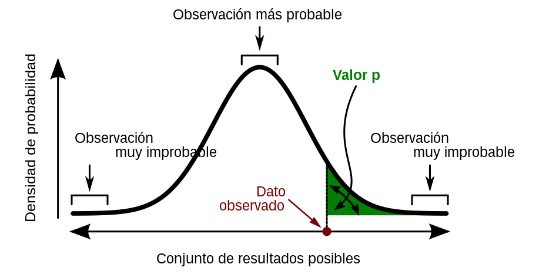

# Pruebas de hipótesis {#PH}

En general, las bases de datos que se trabajarán en esta sección son las siguientes:

- [Imacec](https://raw.githubusercontent.com/Dfranzani/Bases-de-datos-para-cursos/main/2022-2/Estad%C3%ADstica%201/imacec.csv){#Imacec2}: Contiene los datos de los valores del Imacec mensual de distintos sectores desde enero del 2018 hasta junio del 2022. Las columnas de la base de datos son las siguientes:

  - Ano: Año de medición del Imacec.
  - Mes: Mes de medición del Imacec.
  - Mineria: Imacec del sector de minería.
  - Industria: Imacec del sector de industria.
  
  ```{r, echo=FALSE, results="asis", eval=code}
  cat("El código para cargar la base de datos en R es:")
  ```
  
  ```{r, eval = F, echo = code}
  datos = read.csv("https://raw.githubusercontent.com/Dfranzani/Bases-de-datos-para-cursos/main/2022-2/Estad%C3%ADstica%201/imacec.csv")
  ```

- [ICC](https://raw.githubusercontent.com/Dfranzani/Bases-de-datos-para-cursos/main/2022-2/Estad%C3%ADstica%202/consumidor.csv){#ICC}: Contiene registros del Índice de Confianza del Consumidor (ICC). Este indicador de confianza del consumidor proporciona una indicación de la evolución futura del consumo y el ahorro de los hogares. Un indicador por encima de 100 señala un aumento en la confianza de los consumidores hacia la situación económica futura, como consecuencia de la cual son menos propensos a ahorrar y más inclinados a gastar dinero en compras importantes en los próximos 12 meses. Los valores por debajo de 100 indican una actitud pesimista hacia la evolución futura de la economía, lo que posiblemente resulte en una tendencia a ahorrar más y consumir menos.

Las variables que contiene la base de datos son las siguientes:

  - Locacion: lugar en donde se mide el ICC (FRA = Francia, POL = Polonia, OECD = OCDE, ESP = España, BEL = Bélgica, ITA = Italia, DEU = Alemania).
  - Mes: corresponde al mes en el que se realiza la medición del índice.
  - Ano: corresponde al año en el que se realiza la medición del índice.
  - ICC: valor del índice de confianza del consumidor.

  ```{r, echo = FALSE, results="asis", eval=code}
  cat("El código para cargar la base de datos en R es:")
  ```
  
  ```{r, eval = F, echo = code}
  datos = read.csv("https://raw.githubusercontent.com/Dfranzani/Bases-de-datos-para-cursos/main/2022-2/Estad%C3%ADstica%202/consumidor.csv")
  ```

## Concepto

Una **hipótesis estadística** o simplemente *hipótesis* es una pretensión o aseveración sobre el valor de un solo parámetro (característica de la población o característica de una distribución de la población) o sobre los valores de varios parámetros [@Devore, página 285] [@anderson, página 340].

En cualquier cualquier problema de prueba de hipótesis, existen dos hipótesis contradictorias consideradas, la hipótesis nula y la alternativa.

La **hipótesis nula** denotada por $H_0$, es la pretensión de que inicialmente se supone cierta (la pretensión de "creencia previa"). La **hipótesis alternativa** denotada por $H_1$ (o $H_a$), es la aseveración contradictoria a $H_0$.

La hipótesis nula será rechazada en favor de la hipótesis alternativa solo si la evidencia muestral sugiere que $H_0$ es falsa. Si la muestra no contradice fuertemente a $H_0$, se continuará creyendo en la verdad de la hipótesis nula. Las dos posibles conclusiones derivadas de un análisis de prueba de hipótesis son entonces *rechazar* $H_0$ o *no rechazar* $H_0$.

### Elaboración

En algunas aplicaciones no parece obvio cómo formular la hipótesis nula y alternativa. Se debe tener cuidado en estructurar la hipótesis apropiadamente de manera que la conclusión de la prueba de hipótesis proporcione la información que el investigador o la persona encargada de tomar las decisiones desea. A partir de la situación, las pruebas de hipótesis pueden tomar tres formas (tabla \@ref(tab:hipotesis)), las cuales se diferencian en el desigualdad o igualdad empleada en la hipótesis alternativa. 

```{r hipotesis, echo=FALSE}
tabla = matrix(c(rep("$H_0: \\theta = \\theta_0$",3),
                 "$H_1: \\theta \\neq \\theta_0$",
                 "$H_1: \\theta > \\theta_0$",
                 "$H_1:\\theta < \\theta_0$"),
               byrow = T, nrow = 2)

kableExtra::kbl(tabla, align = 'c', booktabs = TRUE,
      caption = "Planteamiento de las pruebas de hipótesis",
      col.names = c("Caso 1", "Caso 2", "Caso 3"), escape = FALSE) |>
  kable_styling(full_width = FALSE, bootstrap_options = c("condensed"), latex_options = c("HOLD_position")) |>
  scroll_box(box_css = "border: 0px; ", extra_css = "overflow-x: auto; ")
```

En diversas ocasiones, $H_1$ se conoce como la "hipótesis del investigador", puesto que es la pretensión que al investigador en realidad le gustaría validar. La palabra *nulo* "significa sin valor",  lo que sugiere que $H_0$ es identificada como la hipótesis de ningún cambio.

:::: {.blackbox}
::: {.example}
Considérese, que el 10% de todas las tarjetas de circuito producidas por un cierto fabricante durante un periodo de tiempo reciente estaban defectuosas. Un ingeniero ha sugerido un cambio en el proceso de producción en la creencia de que dará por resultado una proporción reducida del proceso cambiado. 

La hipótesis alternativa (posición del investigador) es $H_1: p <0.10$, la pretensión de que la modificación del procesos redujo la proporción de las tarjetas defectuosas. Una opción natural para $H_0$ en esta situación es la pretensión contraria a la establecida en $H_1$, es decir, $p\geq 0.1$. En su lugar se considera $H_0: p = 0.1$ contra $H_1: p < 0.1$, tal como se expuso en la tabla anterior.
:::
::::

::: {.exercise}
El gerente de Danvers-Hilton Resort afirma que la cantidad media que gastan los huéspedes en un fin de semana es menos de $\$600$ dólares. Un miembro del equipo de contadores observó que en los últimos meses habían aumentado tales cantidades. El contador emplea una muestra de cuentas de fin de semana para probar la afirmación del gerente.

a.  ¿Qué forma de hipótesis deberá usar para probar la afirmación del gerente? Explique.
    ```{r echo=FALSE}
    tabla = matrix(c(rep("$H_0: \\mu = 600$",3),
                     "$H_1: \\mu \\neq 600$",
                     "$H_1: \\mu > 600$",
                     "$H_1:\\mu < 600$"),
                   byrow = T, nrow = 2)
    
    kableExtra::kbl(tabla, align = 'c', booktabs = TRUE, linesep = "",
                    col.names = c("Caso 1", "Caso 2", "Caso 3"), escape = FALSE) |>
      kable_styling(full_width = FALSE, bootstrap_options = c("condensed"), latex_options = c("HOLD_position")) |>
  scroll_box(box_css = "border: 0px; ", extra_css = "overflow-x: auto; ")
    ```
b.  ¿Cuál es la conclusión apropiada cuando no se puede rechazar la hipótesis nula $H_0$?
c.  ¿Cuál es la conclusión apropiada cuando se puede rechazar la hipótesis nula $H_0$?
:::

::: {.exercise}
El gerente de un negocio de venta de automóviles está pensando en un nuevo plan de bonificaciones, con objeto de incrementar el volumen de ventas. Al presente, el volumen medio de ventas es 14 automóviles por mes. El gerente desea realizar un estudio para ver si el plan de
bonificaciones incrementa el volumen de ventas. Para recolectar los datos, una muestra de vendedores venderá durante un mes bajo el nuevo plan de bonificaciones.

a.  Dé las hipótesis nula y alternativa más adecuadas para este estudio.
b.  Comente la conclusión resultante en el caso en que $H_0$ no pueda rechazarse.
c.  Comente la conclusión que se obtendrá si $H_0$ puede rechazarse.
:::

::: {.exercise}
Debido a los costos y al tiempo de adaptación de la producción, un director de fabricación antes de implantar un nuevo método de fabricación, debe convencer al gerente de que ese nuevo método de fabricación reducirá los costos. El costo medio del actual método de producción es $\$220$ por hora. En un estudio se medirá el costo del nuevo método durante un periodo muestral de producción,

a.  Dé las hipótesis nula y alternativa más adecuadas para este estudio.
b.  Haga un comentario sobre la conclusión cuando $H_0$ no pueda rechazarse.
c.  Dé un comentario sobre la conclusión cuando $H_0$ pueda rechazarse.
:::

### Errores tipo I y II

Las hipótesis nula y alternativa son afirmaciones opuestas acerca de la población. Una de las dos, ya sea la hipótesis nula o la alternativa es verdadera, pero no ambas. Lo ideal es que la prueba de hipótesis lleve a la aceptación de $H_0$ cuando $H_0$ sea verdadera y al rechazo de $H_0$ cuando $H_1$ sea verdadera. Por desgracia, las conclusiones correctas no siempre son posibles. Como la prueba de hipótesis se basa en una información muestral debe tenerse en cuenta que existe la posibilidad de error.

Los dos tipos de errores que se pueden cometer son:

- **Error tipo I:** Rechazar $H_0$ cuando $H_0$ es verdadera.
- **Error tipo II:** No rechazar $H_0$ cuando $H_0$ es falsa.

Es posible el error que se desea cometer, es decir, es posible establecer la probabilidad de cometer un error tipo I o II, pero no ambos. El **nivel de significancia** es la probabilidad de cometer un error tipo I cuando la hipótesis nula es verdadera. Para denotar el nivel de significancia se usa la letra griega $\alpha$, y los valores que se suelen usar para $\alpha$ con 0.05 y 0.01.

:::: {.blackbox}
::: {.example}
Walter Williams, columnista y profesor de economía en la universidad George Mason indica que siempre existe la posibilidad de cometer un error tipo I o un error tipo II al tomar una decisión (*The Cincinnati Enquirer*, 14 de agosto de 2005). Hace notar que la Food and Drug Administration corre el riesgo de cometer estos errores en sus procedimientos para la aprobación de medicamentos.

Cuando comete un error tipo I, la FDA no aprueba un medicamento que es seguro y efectivo. Al cometer un error tipo II, la FDA aprueba un medicamento que presenta efectos secundarios imprevistos. Sin importar la decisión que se tome, la probabilidad de cometer un error costoso no se puede eliminar.
:::
::::

::: {.exercise}
Nielsen informó que los hombres jóvenes estadounidenses ven diariamente 56.2 minutos de televisión en las horas de mayor audiencia (*The Wall Street Journal Europe*, 18 de noviembre de 2003). Un investigador cree que en Alemania, los hombres jóvenes ven más tiempo la televisión en las horas de mayor audiencia. Este investigador toma una muestra de hombres jóvenes alemanes y registra el tiempo que ven televisión en un día. Los resultados muestrales se usan para probar las siguientes hipótesis nula y alternativa.

```{=tex}
\begin{equation}
\notag
\begin{split}
H_0&: \mu = 56.2\\
H_1&: \mu > 56.2\\
\end{split}
\end{equation}
```

a.  En esta situación, ¿cuál es el error tipo I? ¿Qué consecuencia tiene cometer este error?
b.  En esta situación, ¿cuál es el error tipo II? ¿Qué consecuencia tiene cometer este error?
:::

::: {.exercise}
Suponga que se va a implantar un nuevo método de producción si mediante una prueba de hipótesis se confirma la conclusión de que el nuevo método de producción reduce el costo medio de operación por hora.

a.  Dé las hipótesis nula y alternativa adecuadas si el costo medio de producción actual por hora es $\$220$.
b.  En esta situación, ¿cuál es el error tipo I? ¿Qué consecuencia tiene cometer este error?
c.  En esta situación, ¿cuál es el error tipo II? ¿Qué consecuencia tiene cometer este error?
:::

### Procedimiento de prueba

Un procedimiento de prueba es un regla, basada en datos muestrales, para decidir si rechazar $H_0$. Este proceso consta de dos elementos:

- **Estadístico de prueba:** Función de los datos muestrales en los cuales ha de basarse la decisión.
- **Región de rechazo:** Conjunto de todos los valores estadísticos de prueba por los cuales $H_0$ será rechazada.

Para decidir si $H_0$ es finalmente rechazada es posible ocupar dos métodos.

1.  **Método del valor p** 

Un valor-p es una probabilidad que porta a una medida de evidencia suministrada por la muestra contra la hipótesis nula. Valores pequeños indican una evidencia mayor contra la hipótesis nula.

Además de representar un probabilidad, el valor-p puede ser vista como una porción de área bajo la curva. La figura \@ref(fig:graficovalorp) muestra la relación entre los distintos elementos ya mencionados.
    
La curva corresponde a la función de probabilidad de los datos. Los valores centrales son aquellos que son más probables de observar (parte más alta de la curva), mientras que los valores extremos (derecha e izquierda) son los menos probables de observar. El punto de color rojo corresponde al estadístico de prueba, función que nos dará un valor con el que seremos capaces de rechazar o no $H_0$. Finalmente el área de color verde corresponde al área bajo la curva desde el estadístico observado hacia la izquierda (en este caso).

```{r graficovalorp, echo=FALSE, fig.align='center', fig.cap="Estadístico de prueba para un prueba altenativa con signo $>$", out.width = '70%'}

```

La tabla \@ref(tab:regiones), da cuenta de la relación que existe entre las pruebas de hipótesis y la ubicación del valor-p en el gráfico presentado.
    
```{r regiones, echo=FALSE}
tabla = matrix(c("$>$", "$<$","$\\neq$",
                 "Unilateral derecha", "Unilateral izquierda", "Bilateral",
                 "A la derecha del gráfico", "A la izquierda del gráfico", "A ambos lados del gráfico"),
               byrow = F, ncol = 3)

tabla = kableExtra::kbl(tabla, align = 'c', booktabs = TRUE, linesep = "",
      caption = "Hipótesis alternativa, valor-p y estadístico de prueba",
      col.names = c("Signo de comparación en $H_1$", "Referencia", "Ubicación del estadístico de prueba y valor-p"),
      escape = FALSE) |>
  kable_styling(full_width = FALSE,
                bootstrap_options = c("condensed"),
                latex_options = c("HOLD_position", "scale_down")) |>
  scroll_box(box_css = "border: 0px; ", extra_css = "overflow-x: auto; ")

if (knitr:::is_latex_output()) {
  tabla = tabla |>
    column_spec(1, width = "4cm") |> 
    column_spec(2, width = "4cm") |> 
    column_spec(3, width = "5cm")
}
tabla
```

La regla de rechazo usando el valor-p es

$$\text{Rechazar } H_0 \text{ si el valor-p } \leq \alpha$$

En la figura \@ref(fig:regiones3), se puede observar los tres casos posibles para las distintas hipótesis alternativas, en las cuales se ejemplifica un valor-p en cada uno de los casos. De izquierda a derecha, las hipótesis alternativas correspondientes son unilateral izquierda, unilateral derecha, y bilateral. 

```{r regiones3, echo=FALSE,fig.width=6, fig.height=1.5, fig.align="center", fig.cap="Valores -p por tipo de hipótesis alternativa"}
par(mfrow = c(1,3), las = 1, bty = "n")

df_dash = function(cut_point, type = 1){
  if(type == 1){
    aux = df[x <= cut_point,]
  } else {
    aux = df[x >= cut_point,]
  }
  aux = rbind(aux, c(cut_point, df[1, 2]))
  return(aux)
}

x = seq(from = -2, to = 2, by = 0.01)
y = dnorm(x = x)
df = data.frame(x, y)
cut = 1.25

g = ggplot(data = df, mapping = aes(x = x, y = y)) +
  geom_line() + theme_void() + theme(plot.title = element_text(hjust = 0.5))

g1 = g +
  geom_polygon(data = df_dash(-1*cut, type = 1), mapping = aes(x = x, y = y), alpha = 0.3) +
  labs(title = "Unilateral izquierda") 

g2 = g +
  geom_polygon(data = df_dash(cut, type = 2), mapping = aes(x = x, y = y), alpha = 0.3) +
  labs(title = "Unilateral derecha")

g3 = g +
  geom_polygon(data = df_dash(-1*cut, type = 1), mapping = aes(x = x, y = y), alpha = 0.3) + 
  geom_polygon(data = df_dash(cut, type = 2), mapping = aes(x = x, y = y), alpha = 0.3) +
  labs(title = "Bilateral")

gridExtra::grid.arrange(g1, g2, g3, nrow = 1)
```

La decisión de si en cada uno de los casos se rechaza o no la hipótesis nula, depende del valor elegido para la significancia. En la figura \@ref(fig:areas-rechazo-ud) se muestra la comparativa entre el valor-p y $\alpha$ para el caso de una hipótesis alternativa unilateral derecha; el área sombreada de color rojo corresponde al valor de $\alpha$ (**área de rechazo**), mientras que el área sombreada de color gris corresponde al valor-p definido por el estadístico de prueba.

```{r areas-rechazo-ud, echo=FALSE,fig.width=6, fig.height=1.5, fig.align="center", fig.cap="Comparativa del valor-p y el área de rechazo para una prueba unilateral derecha"}
g4 = g +
  geom_polygon(data = df_dash(1.2, type = 2), mapping = aes(x = x, y = y), alpha = 0.3, fill = "red") +
  labs(title = expression("Región de rechazo:" ~ alpha)) 

g5 = g +
  geom_polygon(data = df_dash(1.2, type = 2), mapping = aes(x = x, y = y), alpha = 0.3, fill = "red") +
  geom_polygon(data = df_dash(1.4, type = 2), mapping = aes(x = x, y = y), alpha = 0.3) +
  labs(title = expression("Valor-p" <= alpha))

g6 = g +
  geom_polygon(data = df_dash(1.2, type = 2), mapping = aes(x = x, y = y), alpha = 0.3, fill = "red") +
  geom_polygon(data = df_dash(1, type = 2), mapping = aes(x = x, y = y), alpha = 0.3) +
  labs(title = expression("Valor-p" > alpha))
  
gridExtra::grid.arrange(g4, g5, g6, nrow = 1)
```

Cabe recordar que, el valor de alfa (valor del área roja en la figura \@ref(fig:areas-rechazo-ud)) estará dado por el investigador (subjetivo), mientras que el valor del área gris se debe determinar a partir de los datos de la muestra (estadístico de prueba).

2. **Método del valor crítico**

Este método consiste en comparar el estadístico de prueba con un número fijo llamado **valor crítico**. El valor crítico es un punto de referencia para determinar si el valor del estadístico de prueba es lo suficientemente pequeño para rechazar la hipótesis nula. El valor
crítico corresponde a la coordenada del eje horizontal que define el área llamada $\alpha$ (fijado por el investigador), y está ubicada en el mismo sector que el valor-p. 

El intervalo de números generado a partir del valor crítico es lo denominado **región de rechazo**. En la figura \@ref(fig:region-rechazo-1), se observa que una hipótesis nula es rechazada cuando el valor-p es menor o igual a $\alpha$, lo cual, es equivalente a decir que (gráfico de la izquierda), el estadístico de prueba (1.4) es mayor o igual al valor crítico (0.8), a esto se le denomina "caer en la región de rechazo". El razonamiento de rechazo utilizando el valor crítico depende de la zona en la que se ubica alfa y el valor-p.

```{r region-rechazo-1, echo=FALSE,fig.width=5, fig.height=1.5, fig.align="center", fig.cap="Método del valor crítico para una hipótesis unilateral derecha"}
par(mfrow = c(1,2), las = 1, bty = "n")
g = ggplot(data = df, mapping = aes(x = x, y = y)) +
  geom_line() + theme(plot.title = element_text(hjust = 0.5)) +
  theme(panel.background = element_rect(fill = "transparent"),
        axis.text.y = element_blank(),
        axis.ticks.y = element_blank(),
        axis.title = element_blank())

g7 = g +
  geom_polygon(data = df_dash(0.8, type = 2), mapping = aes(x = x, y = y), alpha = 0.3, fill = "red") +
  geom_polygon(data = df_dash(1.4, type = 2), mapping = aes(x = x, y = y), alpha = 0.3) +
  labs(title = expression("Valor-p" <= alpha)) + 
  scale_x_continuous(breaks = c(0.8, 1.4), labels = c(0.8, 1.4))

g8 = g +
  geom_polygon(data = df_dash(0.8, type = 2), mapping = aes(x = x, y = y), alpha = 0.3, fill = "red") +
  geom_polygon(data = df_dash(0.2, type = 2), mapping = aes(x = x, y = y), alpha = 0.3) +
  labs(title = expression("Valor-p" > alpha)) + 
  scale_x_continuous(breaks = c(0.8, 0.2), labels = c(0.8, 0.2))
  
gridExtra::grid.arrange(g7, g8, nrow = 1)
```

Los lineamientos de cómo construir un estadístico de prueba, determinar el varlo crítico y el valor-p asociados a una prueba de hipótesis, se darán a conocer a partir de la sección \@ref(pruebas).

### Intervalos de confianza

Existe un relación directa entre las pruebas de hipótesis y los intervalos de confianza, ya que estos pueden ser utilizados para rechazar o no $H_0$. La tabla \@ref(tab:ICpruebas), da cuenta de del tipo de intervalo de confianza que se debe elaborar para cada tipo de prueba de hipótesis.

```{r ICpruebas, echo=FALSE}
tabla = matrix(c("$>$", "$<$","$\\neq$",
                 "$(a,\\infty )$", "$(-\\infty ,b)$", "$(a,b)$"),
               byrow = F, ncol = 2)

kableExtra::kbl(tabla, align = 'c', booktabs = TRUE, linesep = "",
      caption = "Hipótesis alternativa e Intervalo de confianza",
      col.names = c("Signo de comparación en $H_1$", "Tipo de intervalo de confianza"),
      escape = FALSE) |>
  kable_styling(full_width = FALSE,
                bootstrap_options = c("condensed"),
                latex_options = c("HOLD_position")) |>
  scroll_box(box_css = "border: 0px; ", extra_css = "overflow-x: auto; ")
```

A lo largo de las distintas pruebas, se abordarán los distintos métodos de prueba, incluyendo el uso de intervalos de confianza.

## Prueba de hipótesis para la media {#pruebas}

Esta sección se centra en el planteamiento y prueba de hipótesis relacionadas a la parámetro de media. Para cada uno de estos casos, se detalla el procedimiento en R y los distintos métodos de prueba para la decisión de rechazo de $H_0$. En particular, las pruebas para este parámetro requieren que la distribución poblacional de la variable de estudio es normal, lo cual, se asumirá en los enunciados de los ejercicios y/o ejemplos según corresponda.

### Prueba de hipótesis para la media de una distribución normal con varianza poblacional conocida

Aun cuando la suposición de que el valor de $\sigma^2$ es conocido, rara vez se cumple en la práctica. Este caso proporciona un buen punto de partida debido a la facilidad con que los procedimientos generales y sus propiedades pueden ser desarrollados. La hipótesis nula en los tres casos propondrá que $\mu$ tiene un valor numérico particular, el valor nulo, el cual será denotado por $\mu_0$.

El estadístico de prueba y los valores críticos de comparación están dados en la tabla \@ref(tab:unamedia1).

```{r unamedia1, echo=FALSE}
tabla = data.frame(rep("$H_0: \\mu = \\mu_0$", 3),
                   rep("$Z_0 = \\displaystyle\\frac{\\bar{x}-\\mu_0}{\\sigma/\\sqrt{n}}$", 3),
                   c("$H_1: \\mu \\neq \\mu_0$", 
                     "$H_1: \\mu \\gt \\mu_0$", 
                     "$H_1: \\mu \\lt \\mu_0$"),
                   c("$|Z_0| \\geq Z_{1-\\alpha/2}$",
                     "$Z_0 \\geq Z_{1-\\alpha}$",
                     "$Z_0 \\leq Z_{\\alpha}$"))

kableExtra::kbl(tabla, align = 'l', booktabs = TRUE, linesep = "", escape = FALSE,
                col.names = c("Hipótesis nula", "Estadístico de prueba", "Hipótesis alternativa", "Criterio de rechazo"),
                caption = "Criterios de rechazo para la prueba de una media con varianza poblacional conocida") |>
  collapse_rows(columns = 1:2, valign = "middle") |>
  kable_styling(full_width = FALSE,
                bootstrap_options = c("condensed"),
                latex_options = c("HOLD_position", "scale_down")) |>
  scroll_box(box_css = "border: 0px; ", extra_css = "overflow-x: auto; ")
```

:::: {.blackbox}
::: {.example}

El índice Rockwell de dureza para acero se determina al presionar una punta de diamante en el acero y medir la profundidad de la penetración, el cual tiene un varianza de medición de 6. Para 50 especímenes de una aleación de acero, el índice Rockwell de dureza promedió 62. El fabricante dice que esta aleación tiene un índice de dureza promedio menor a 64. Asumiendo que el índice de dureza sigue una distribución normal, ¿hay suficiente evidencia para refutar lo dicho por el fabricante con un nivel de significancia de 1%?

Al plantear la prueba de hipótesis se debe tener en cuenta que la hipótesis del investigador ha de estar reflejada en $H_1$, tal como se muestra a continuación.

- $\mu$: media del índice de dureza de la aleación de acero.

```{=tex}
\begin{equation}
\notag
\begin{split}
H_0&: \mu = 64\\
H_1&: \mu < 64
\end{split}
\end{equation}
```


1.  **Método del valor-p**

    Verificación del criterio de rechazo: Valor-p $\leq \alpha$.
    
    ```{r}
    # Cálculo del estadístico de prueba
    z0 = (62-64)/(sqrt(6)/sqrt(50))
    z0
    ```
    
    ```{r}
    # Cálculo del valor-p
    valor_p = pnorm(z0)
    valor_p
    ```
    
    ```{r}
    # Verificación el criterio
    valor_p <= 0.01
    ```
    
    
    **Interpretación utilizando el método del valor-p**: El valor-p cercano a 0 es menor o igual a la significancia del 0.01, por lo cual, existe suficiente evidencia estadística para rechazar la hipótesis nula, es decir, existe suficiente evidencia para apoyar la afirmación de que la media del índice de dureza de la aleación de acero es menor a 64. Considerando una confianza del 99%.

2.  **Método del valor crítico**

    En caso de que deseemos utilizar el método del valor-p, es necesario apoyarnos en R para realizar el calculo de este. El comando necesario para calcular el valor depende la prueba que estemos llevando a cabo, por lo que en el siguiente [documento](material/resumenes/Rechazo.pdf) podrán encontrar un resumen para las distintas pruebas.

    Verificación del criterio de rechazo: $Z_0 \leq Z_{\alpha}$.
    
    ```{r}
    # Cálculo del valor crítico
    valor_critico = qnorm(0.01)
    valor_critico
    ```
    
    ```{r}
    # Verificación del criterio
    z0 <= valor_critico
    ```
  
    **Interpretación utilizando el método del valor crítico**: El valor del estadístico de prueba de -5.7735 es menor o igual al valor crítico de -2.3263, por lo cual, existe suficiente evidencia estadística para rechazar la hipótesis nula, es decir, existe suficiente evidencia para apoyar la afirmación de que la media del índice de dureza de la aleación de acero es menor a 64. Considerando una confianza del 99%.

3.  **Método del intervalo de confianza**

    Al igual que el valor-p, la forma en la que se debe usar el intervalo de confianza varía dependiendo del tipo de prueba de hipótesis que se realiza, por lo que en el siguiente [documento](material/resumenes/hipotesis+ic.pdf) podrán encontrar un resumen para las distintas pruebas, dicho documento incluye los distintos comando en R para obtener los resultados de una prueba de hipótesis de manera automática.

    Verificación del criterio de rechazo: $\mu_0 \notin$ IC.

    El intervalo de confianza a construir es:
    
    ```{=tex}
    \begin{equation}
      \notag
      \left(-\infty, \bar{x} + Z_{1-\alpha}\frac{\sigma}{\sqrt{n}}\right)
    \end{equation}
    ```
    
    ```{r}
    # Cálculo de los límites del intervalo de confianza
    Limite_superior = 62 + qnorm(0.99)*sqrt(6)/sqrt(50)
    Limite_superior
    ```
    
    
    ```{r}
    # Verificación del criterio
    64 > Limite_superior
    ```
    
    **Interpretación utilizando el método del intervalo de confianza**: El intervalo de confianza $(-\infty, 62.8058)$ no contiene al valor de $\mu_0 = 64$, por lo cual, existe suficiente evidencia estadística para rechazar la hipótesis nula, es decir, existe suficiente evidencia para apoyar la afirmación de que la media del índice de dureza de la aleación de acero es menor a 64. Considerando una confianza del 99%.

:::
::::

Para este tipo de pruebas, no hay comandos en R que permitan hacer el trabajo de manera automática. Esto es debido a lo expuesto en un principio: **difícilmente se conoce la varianza poblacional en la práctica**.


::: {.exercise}
Sea el estadístico de prueba $Z_0$ con una distribución normal estándar cuando $H_0$ es verdadera. Dé el nivel de significación en cada una de las siguientes situaciones:

a.  $H_1: \mu > \mu_0$, región de rechazo $Z_0\geq 1.88$.
b.  $H_1: \mu < \mu_0$, región de rechazo $Z_0\leq -2.75$.
c.  $H_1: \mu \neq \mu_0$, región de rechazo $Z_0\geq 2.88$ o $Z_0\leq -2.88$.
:::

::: {.exercise}
Un fabricante de cajas de cartón afirma que sus cajas tienen un peso promedio de 5 kg. Para verificar esta afirmación, un cliente selecciona al azar 25 cajas y encuentra que el peso promedio es de 4.8 kg con una desviación estándar conocida de 0.5 kg. ¿Hay suficiente evidencia para rechazar la afirmación del fabricante al nivel de significancia del 5%?
:::

::: {.exercise}
Se sabe que la duración de las baterías sigue una distribución normal con media 290 horas y varianza poblacional conocida de 64 horas. Bajo una nueva fórmula de fabricación, se tomó una muestra aleatoria de 36 dispositivos móviles y se registró una duración media muestral de 280 horas. Utilizando un nivel de significancia del 5%, ¿se puede concluir con suficiente evidencia estadística que la duración media de las baterías ha mejorado significativamente después de aplicar una nueva fórmula en su fabricación? 
:::

::: {.exercise}
Un cirujano necesita evaluar si los pacientes se recuperan en un promedio en un tiempo menor a 5 días después de una cirugía. Para probar su afirmación, un internista toma una muestra aleatoria de 20 pacientes y encuentra que la duración promedio de recuperación es de 6 días, con una desviación estándar conocida de 1.5 días. ¿Hay suficiente evidencia para rechazar la afirmación del cirujano al nivel de significancia del 10%?
:::

::: {.exercise}
Se requiere estudiar si la cantidad promedio de cafeína en una taza de café es menor a 100 mg. Para probar esta hipótesis, se toma una muestra aleatoria de 50 tazas de café y se encuentra que la cantidad promedio de cafeína es de 105 mg, con una desviación estándar conocida de 15 mg. ¿Hay suficiente evidencia para rechazar la hipótesis nula al nivel de significancia del 5%?
:::

::: {.exercise}
Se desea evaluar si la altura promedio de una población de girasoles es distinta de 150 cm. Para ello, se selecciona una muestra aleatoria de 30 girasoles y se encuentra que la altura promedio es de 155 cm, con una desviación estándar conocida de 5 cm. ¿Hay suficiente evidencia para rechazar la hipótesis nula al nivel de significancia del 1%?
:::

### Prueba de hipótesis para la media de una distribución normal con varianza poblacional desconocida

De igual manera a lo expuesto en el primer caso, los pasos a seguir para probar una hipótesis son los mismos, y se mantendrá así para cualquier caso.

1. Plantear las hipótesis nula y alternativa
2. Identificar o establecer el nivel de significancia.
3. Identificar los datos muestrales y poblacionales con los que se cuenta.
4. Utilizar alguna de las reglas de decisión (Estadístico de prueba, valor-p o intervalo de confianza).
5. Concluir

En la situación de una prueba de hipótesis de la media, en la cual lo datos distribuyen normal y la varianza poblacional es desconocida, los criterios de rechazo son similares a los vistos anteriormente, sin embargo, cambia la distribución del estadístico de prueba, tal como se muestra en la tabla \@ref(tab:unamedia2). 

```{r unamedia2, echo=FALSE}
tabla = data.frame(rep("$H_0: \\mu = \\mu_0$", 3),
                   rep("$t_0 = \\displaystyle\\frac{\\bar{x}-\\mu_0}{S/\\sqrt{n}}$", 3),
                   c("$H_1: \\mu \\neq \\mu_0$", 
                     "$H_1: \\mu \\gt \\mu_0$", 
                     "$H_1: \\mu \\lt \\mu_0$"),
                   c("$|t_0| \\geq t_{1-\\alpha/2, n-1}$",
                     "$t_0 \\geq t_{1-\\alpha,n-1}$",
                     "$t_0 \\leq t_{\\alpha,n-1}$"))

kableExtra::kbl(tabla, align = 'l', booktabs = TRUE, linesep = "", escape = FALSE,
                col.names = c("Hipótesis nula", "Estadístico de prueba", "Hipótesis alternativa", "Criterio de rechazo"),
                caption = "Criterios de rechazo para la prueba de una media con varianza poblacional desconocida") |>
  collapse_rows(columns = 1:2, valign = "middle") |>
  kable_styling(full_width = FALSE,
                bootstrap_options = c("condensed"),
                latex_options = c("HOLD_position", "scale_down")) |>
  scroll_box(box_css = "border: 0px; ", extra_css = "overflow-x: auto; ")
```

donde $n$ corresponde al tamaño de la muestra.

:::: {.blackbox}
::: {.example #imacec}
Utilizando la base de datos [Imacec](#Imacec2), establezca si hay suficiente evidencia estadística para afirmar que, el valor promedio del Imacec de cada sector por separado es mayor a 98.54167 (denote este valor por $\mu_0$). Establezca las hipótesis respectivas, estadísticos y criterios de rechazo, utilizando una significancia del 10%. Asuma que las variables distribuyen normal y tienen varianza poblacional desconocida.

En este caso al contar con una base de datos (y para este tipo de prueba), podemos hacer uso directamente de R para obtener el estadístico de prueba, valor-p e intervalo de confianza asociado. 

```{r, echo=FALSE}
df = read.csv("https://raw.githubusercontent.com/Dfranzani/Bases-de-datos-para-cursos/main/2022-2/Estad%C3%ADstica%201/imacec.csv")
```

Iniciamos con la prueba de hipótesis para el sector de minería.

- $\mu:$ Media del Imacec de Minería.

```{=tex}
\begin{equation}
    \notag
    \begin{split}
        H_0: \mu = 98.54167\\
        H_1: \mu > 98.54167
    \end{split}
\end{equation}
```

Luego, haciendo uso de R obtenemos los elementos necesario para rechazar o no $H_0$.

```{r}
# Cargue previamente la base de datos, guardándola con el nombre "df"
# Minería
t.test( # Prueba de hipótesis para el estadístico con distribución t-student
  x = df$Mineria, # Valores del Imacec de Minería
  alternative = "greater", # Signo de desigualdad de la hipótesis alternativa
  mu = 98.54167, # Valor del Mu_0
  conf.level = 0.9 # Confianza = 1 - alfa
  )
```

1.  **Método del valor-p**

    Verificación del criterio de rechazo: Valor-p $\leq \alpha$.
    
    ```{r}
    # Cálculo del valor-p
    valor_p = 0.8965
    # Verificación el criterio
    valor_p <= 0.1
    ```
    
    **Interpretación utilizando el método del valor-p**: El valor-p de 0.8965 es menor o igual a la significancia del 0.1, por lo cual, no existe suficiente evidencia estadística para rechazar la hipótesis nula, es decir, no existe suficiente evidencia para apoyar la afirmación de que el valor promedio del Imacec del sector de Minería es mayor a 98.54167. Considerando una confianza del 90%.

2.  **Método del valor crítico**

    Verificación del criterio de rechazo: $t_0 \geq t_{1-\alpha,n-1}$.
    
    ```{r}
    # Cálculo del valor crítico
    valor_critico = qt(1-0.1, df = 53)
    valor_critico
    ```
    
    ```{r}
    # Verificación el criterio
    t0 = -1.2773
    t0 >= valor_critico
    ``` 
    
    **Interpretación utilizando el método del valor crítico**: El estadístico de prueba de -1.2773 no es mayor o igual al valor crítico de 1.2977, por lo cual, no existe suficiente evidencia estadística para rechazar la hipótesis nula, es decir, no existe suficiente evidencia para apoyar la afirmación de que el valor promedio del Imacec del sector de Minería es mayor a 98.54167. Considerando una confianza del 90%.

3.  **Método del intervalo de confianza**

    Verificación del criterio de rechazo: $\mu_0 \notin$ IC.
    
    ```{r}
    # Verificación del criterio
    Limite_inferior = 96.21024
    98.54167 < Limite_inferior
    ```
    
    **Interpretación utilizando el método del intervalo de confianza**: El intervalo de confianza $(98.5416, \infty)$ contiene al valor de $\mu_0 = 98.54167$, por lo cual, no existe suficiente evidencia estadística para rechazar la hipótesis nula, es decir, no existe suficiente evidencia para apoyar la afirmación de que el valor promedio del Imacec del sector de Minería es mayor a 98.54167. Considerando una confianza del 90%.


La prueba de hipótesis para el sector de industria es la siguiente.

- $\mu:$ Media del Imacec de Industria.

```{=tex}
\begin{equation}
    \notag
    \begin{split}
        H_0: \mu = 98.54167\\
        H_1: \mu > 98.54167
    \end{split}
\end{equation}
```

```{r}
# Industria
t.test( # Prueba de hipótesis para el estadístico con distribución t-student
  x = df$Industria, # Valores del Imacec de Industria
  alternative = "greater", # Signo de desigualdad de la hipótesis alternativa
  mu = 98.54167, # Valor del Mu_0
  conf.level = 0.9 # Confianza = 1 - alfa
  )
```

1.  **Método del valor-p**

    Verificación del criterio de rechazo: Valor-p $\leq \alpha$.
    
    ```{r}
    # Cálculo del valor-p
    valor_p = 0.08857
    # Verificación el criterio
    valor_p <= 0.1
    ```
    
    **Interpretación utilizando el método del valor-p**: El valor-p de 0.8965 menor o igual a la significancia del 0.1, por lo cual, existe suficiente evidencia estadística para rechazar la hipótesis nula, es decir, existe suficiente evidencia para apoyar la afirmación de que el valor promedio del Imacec del sector de Industria es mayor a 98.54167. Considerando una confianza del 90%.

2.  **Método del valor crítico**

    Verificación del criterio de rechazo: $t_0 \geq t_{1-\alpha,n-1}$.
    
    ```{r}
    # Cálculo del valor crítico
    valor_critico = qt(1-0.1, df = 53)
    valor_critico
    ```
    
    ```{r}
    # Verificación el criterio
    t0 = 1.3678
    t0 >= valor_critico
    ``` 
    
    **Interpretación utilizando el método del valor crítico**: El estadístico de prueba de 1.3678 es mayor o igual al valor crítico de 1.2977, por lo cual, existe suficiente evidencia estadística para rechazar la hipótesis nula, es decir, existe suficiente evidencia para apoyar la afirmación de que el valor promedio del Imacec del sector de Industria es mayor a 98.54167. Considerando una confianza del 90%.

3.  **Método del intervalo de confianza**

    Verificación del criterio de rechazo: $\mu_0 \notin$ IC.
    
    ```{r}
    # Verificación del criterio
    Limite_inferior = 98.6009
    98.54167 < Limite_inferior
    ```
    
    **Interpretación utilizando el método del intervalo de confianza**: El intervalo de confianza $(98.6009, \infty)$ no contiene al valor de $\mu_0 = 98.54167$, por lo cual, existe suficiente evidencia estadística para rechazar la hipótesis nula, es decir, existe suficiente evidencia para apoyar la afirmación de que el valor promedio del Imacec del sector de Industria es mayor a 98.54167. Considerando una confianza del 90%.

:::
::::

::: {.exercise}
Utilizando la base de datos [Imacec](#Imacec2), establezca si hay suficiente evidencia estadística para afirmar que, el valor promedio del Imacec de cada sector durante el año 2022 es mayor 96.89167. Establezca las hipótesis, estadísticos y criterios de rechazo. Utilice una significancia del 7%. Además, asuma que las variables distribuyen normal y tienen varianza poblacional desconocida. Concluya.
:::

::: {.exercise #metano}
El control de emisión de residuos ha sido un tema que ha cobrado gran importancia en los últimos 20 años debido a los efectos del calentamiento global. Uno de los tantos residuos que contamina el aire es el Metano (CH4). Para estudiar este fenómeno haremos uso de la base [*metano.csv*](https://raw.githubusercontent.com/Dfranzani/Bases-de-datos-para-cursos/main/2022-2/Estad%C3%ADstica%202/metano.csv), la cual contiene los siguientes datos:

- Año: año en el que se realiza la medición de emisión de CH4.
- Mes: mes del año en el que se realiza la medición de emisión de CH4.
- CH4: concentración de CH4 (partes por miles de millones) en un muestra de aire.

Establezca si hay suficiente evidencia estadística para afirmar lo siguiente:

1. La concentración promedio de metano es distinta a 1700 partes por miles de millones.
2. La concentración promedio de metano del año 2021 es superior a 1780 partes por miles de millones. 
3. La concentración promedio de metano del periodo en el periodo de años 2019 - 2022 (inclusive) es inferior a 1750 partes por miles de millones.

Establezca las hipótesis respectivas, estadísticos y criterios de rechazo, utilice una significancia del 7%. Asuma que las variables distribuyen normal y tienen varianza poblacional desconocida. Concluya.
:::

::: {.exercise #consumidor}
Utilizando la base de datos [ICC](#ICC), estudie si hay suficiente evidencia estadística para afirmar lo siguiente:

1. El promedio del ICC es distinto a 100 puntos.
2. El promedio del ICC en Francia es menor a 105 puntos.
3. El promedio del ICC en Alemania es mayor a 107 puntos.

Establezca las hipótesis, estadísticos y criterios de rechazo. Utilice una significancia del 12%. Además, asuma que las variables distribuyen normal y tienen varianza poblacional desconocida. Concluya.
:::

## Prueba de hipótesis para la diferencia de medias

En esta sección se continúa con el estudio de la inferencia estadística, específicamente para la diferencia entre dos medias poblacionales. Por ejemplo, quizá desee obtener una estimación por intervalo para la diferencia entre el salario inicial medio de la población de hombres y el salario inicial medio de la población de mujeres [@anderson, página 395]. Para este tipo de pruebas, se requiere que las distribuciones poblacionales de las variables sean normales e independientes, lo cual, se asumirá en los enunciados de ejemplos y/o ejercicios según corresponda.

### Prueba de hipótesis para la diferencia de medias de dos distribuciones normales con varianzas poblacionales conocidas

El primero de los tres casos corresponde al de varianzas poblacionales conocidas. La tabla \@ref(tab:dosmedias1) da cuenta del estadístico de prueba asociado las respectivas hipótesis, además de los criterios asociados al valor crítico correspondiente.

```{r dosmedias1, echo=FALSE}
tabla = data.frame(rep("$H_0: \\mu_X - \\mu_Y = \\delta_0$", 3),
                   rep("$Z_0 = \\displaystyle\\frac{\\bar{x} - \\bar{y} - \\delta_0}{\\sqrt{\\sigma^2_X/n_X + \\sigma^2_Y/n_Y}}$", 3),
                   c("$H_1: \\mu_X - \\mu_Y \\neq \\delta_0$", 
                     "$H_1: \\mu_X - \\mu_Y \\gt \\delta_0$", 
                     "$H_1: \\mu_X - \\mu_Y \\lt \\delta_0$"),
                   c("$|Z_0| \\geq Z_{1-\\alpha/2}$",
                     "$Z_0 \\geq Z_{1-\\alpha}$",
                     "$Z_0 \\leq Z_{\\alpha}$"))

kableExtra::kbl(tabla, align = 'l', booktabs = TRUE, linesep = "", escape = FALSE,
                col.names = c("Hipótesis nula", "Estadístico de prueba", "Hipótesis alternativa", "Criterio de rechazo"),
                caption = "Criterios de rechazo para la prueba de de diferencia de medias con varianzas poblacionales conocidas") |>
  collapse_rows(columns = 1:2, valign = "middle") |>
  kable_styling(full_width = FALSE,
                bootstrap_options = c("condensed"),
                latex_options = c("HOLD_position", "scale_down")) |>
  scroll_box(box_css = "border: 0px; ", extra_css = "overflow-x: auto; ")
```

:::: {.blackbox}
::: {.example}
En dos ciudades se llevó acabo una encuesta sobre el costo de la vida, en relación al gasto promedio en alimentación en familias constituidas por cuatro personas. De cada ciudad se seleccionó aleatoriamente una muestra de 20 familias y se observaron sus gastos semanales en alimentación. Las medias muestrales y desviaciones estándar poblacionales fueron las siguientes:

```{=tex}
\begin{equation}
\notag
\begin{split}
\bar{x} = 135, & \text{ } \sigma_X = 15\\
\bar{y} = 122, & \text{ } \sigma_Y = 10
\end{split}
\end{equation}
```

Si se supone que se muestrearon dos poblaciones independientes con distribución normal cada una, analizar si existe una diferencia real entre ambas medias. Considere una confianza del 95%.

Las hipótesis a plantear son las siguientes.

- $\mu_X:$ gasto medio semanal en alimentación en la ciudad X. 
- $\mu_Y:$ gasto medio semanal en alimentación en la ciudad Y.

```{=tex}
\begin{equation}
\notag
  \begin{split}
    H_0&: \mu_{X} - \mu_{Y} = 0\\
    H_1&: \mu_{X} - \mu_{Y} \neq 0\\
  \end{split}
\end{equation}
```

Al igual que en la prueba para una media cuando se conoce la varianza poblacional, esta prueba no tiene una implementación directa en R, por lo que construiremos manualmente los métodos de rechazo.

```{r}
x.barra = 135
y.barra = 122
sigma.x = 15
sigma.y = 10
nx = 20
ny = 20
alfa = 0.05
delta0 = 0
```

1.  **Método del valor-p**

    Verificación del criterio de rechazo: Valor-p $\leq \alpha$.
    
    ```{r}
    # Cálculo del estadístico de prueba
    z0 = (x.barra - y.barra - delta0)/sqrt(sigma.x^2/nx+sigma.y^2/ny)
    z0
    ```
    
    ```{r}
    # Cálculo del valor-p
    valor_p = 2-2*pnorm(abs(z0))
    valor_p
    ```
    
    ```{r}
    # Verificación el criterio
    valor_p <= alfa
    ```
    
    
    **Interpretación utilizando el método del valor-p**: El valor-p de 0.0012 es menor o igual a la significancia del 0.05, por lo cual, existe suficiente evidencia estadística para rechazar la hipótesis nula, es decir, existe suficiente evidencia para apoyar la afirmación de que existe diferencia entre los gastos de alimentación promedio entre las familias de ambas ciudades. Considerando una confianza del 95%.

2.  **Método del valor crítico**

    Verificación del criterio de rechazo: $|Z_0| \geq Z_{1-\alpha/2}$.
    
    ```{r}
    # Cálculo del valor crítico
    valor_critico = qnorm(1-alfa/2)
    valor_critico
    ```
    
    ```{r}
    # Verificación del criterio
    abs(z0) >= qnorm(1-alfa/2)
    ```
  
    **Interpretación utilizando el método del valor crítico**: El valor absoluto del estadístico de prueba de 3.2249 es mayor o igual al valor crítico de 1.9599, por lo cual, existe suficiente evidencia estadística para rechazar la hipótesis nula, es decir, existe suficiente evidencia para apoyar la afirmación de que existe diferencia entre los gastos de alimentación promedio entre las familias de ambas ciudades. Considerando una confianza del 95%.

3.  **Método del intervalo de confianza**

    Verificación del criterio de rechazo: $\delta_0 \notin$ IC.

    El intervalo de confianza a construir es:
    
    ```{=tex}
    \begin{equation}
      \notag
      \left(\bar{x} - \bar{y} \pm Z_{1-\alpha/2}\sqrt{\frac{\sigma_X^2}{n_X} + \frac{\sigma_Y^2}{n_Y}}\right)
    \end{equation}
    ```
    
    ```{r}
    # Cálculo de los límites del intervalo de confianza
    Limite_inferior = x.barra - y.barra - qnorm(1-alfa/2)*sqrt(sigma.x^2/nx + sigma.y^2/ny)
    Limite_superior = x.barra - y.barra + qnorm(1-alfa/2)*sqrt(sigma.x^2/nx + sigma.y^2/ny)
    c(Limite_inferior, Limite_superior)
    ```
    
    
    ```{r}
    # Verificación del criterio
    0 < Limite_inferior | 0 > Limite_superior
    ```
    
    **Interpretación utilizando el método del intervalo de confianza**: El intervalo de confianza $(5.0991, 20.9008)$ no contiene al valor de $\delta_0 = 0$, por lo cual, existe suficiente evidencia estadística para rechazar la hipótesis nula, es decir, existe suficiente evidencia para apoyar la afirmación de que existe diferencia entre los gastos de alimentación promedio entre las familias de ambas ciudades. Considerando una confianza del 95%.

:::
::::

:::{.exercise #cuotas}
La base [*control+cuotas.csv*](https://raw.githubusercontent.com/Dfranzani/Bases-de-datos-para-cursos/main/2023-1/control%2Bcuotas.csv) contiene datos de los valores cuota de los primeros tres meses del año 2022 de las AFP Plan Vital y Provida, específicamente de un fondo A de un APV.

Se está interesado en saber si, la media de los valores cuota de Plan Vital supera al de Provida por más de 30000 pesos. Considere una confianza del 99%. Plantee y pruebe una hipótesis para la diferencia de medias, considerando $\sigma^2_{\text{Provida}} = 1165833$ y $\sigma^2_{\text{Plan Vital}} = 3393141$. Utilice todos los métodos de rechazo.
:::

### Prueba de hipótesis para la diferencia de medias de dos distribuciones normales con varianzas poblacionales desconocidas e iguales

Para el segundo caso, las varianzas poblacionales son desconocidas, sin embargo, los valores de estas varianzas poblacionales pueden ser iguales o distintos. La tabla \@ref(tab:dosmedias2) refleja el estadístico de prueba y los criterios de rechazo asociados al método del valor crítico, para el caso en que los valores de las varianzas poblacionaes desconocidas son iguales.

```{r dosmedias2, echo=FALSE}
tabla = data.frame(rep("$H_0: \\mu_X - \\mu_Y = \\delta_0$", 3),
                   rep("$t_0 = \\displaystyle\\frac{\\bar{x} - \\bar{y} - \\delta_0}{S_p\\sqrt{1/n_X + 1/n_Y}}$", 3),
                   c("$H_1: \\mu_X - \\mu_Y \\neq \\delta_0$", 
                     "$H_1: \\mu_X - \\mu_Y \\gt \\delta_0$", 
                     "$H_1: \\mu_X - \\mu_Y \\lt \\delta_0$"),
                   c("$|t_0| \\geq t_{1-\\alpha/2,k}$",
                     "$t_0 \\geq t_{1-\\alpha,k}$",
                     "$t_0 \\leq t_{\\alpha,k}$"))

kableExtra::kbl(tabla, align = 'l', booktabs = TRUE, linesep = "", escape = FALSE,
                col.names = c("Hipótesis nula", "Estadístico de prueba", "Hipótesis alternativa", "Criterio de rechazo"),
                caption = "Criterios de rechazo para la prueba de de diferencia de medias con varianzas poblacionales desconocidas e iguales") |>
  collapse_rows(columns = 1:2, valign = "middle") |>
  kable_styling(full_width = FALSE,
                bootstrap_options = c("condensed"),
                latex_options = c("HOLD_position", "scale_down")) |>
  scroll_box(box_css = "border: 0px; ", extra_css = "overflow-x: auto; ")
```

Donde los valores de $k$ y $S_p$ son los siguientes.

```{=tex}
\begin{equation}
\notag
k = n_X + n_Y-2
\end{equation}
```

```{=tex}
\begin{equation}
\notag
S_p^2 = \frac{(n_X-1)S_X^2 + (n_Y-1)S_Y^2}{n_X+n_Y-2}
\end{equation}
```

:::: {.blackbox}
::: {.example #consumidor}
Considere la base de datos [ICC](#ICC). Se está interesado en saber si el valor promedio del ICC en Alemania menos el de Francia es menor a 1.1. Elabore una prueba de hipótesis para analizar este interés con un 90% de confianza. Concluya utilizando el valor -- p. Además, que las varianzas poblaciones son iguales.

- $\mu_X:$ media del ICC de Alemania. 
- $\mu_Y:$ media del ICC de Francia.

```{=tex}
\begin{equation}
\notag
  \begin{split}
    H_0&: \mu_{X} - \mu_{Y} = 1.1\\
    H_1&: \mu_{X} - \mu_{Y} < 1.1\\
  \end{split}
\end{equation}
```

```{r, echo=FALSE}
datos = read.csv("https://raw.githubusercontent.com/Dfranzani/Bases-de-datos-para-cursos/main/2022-2/Estad%C3%ADstica%202/consumidor.csv")
```

```{r}
# Cargue previamente la base guardándola con el nombre "datos"
ICC_Alemania = datos$ICC[datos$Locacion == "DEU"] # Valores del ICC de Alemania
ICC_Francia = datos$ICC[datos$Locacion == "FRA"] # Valores del ICC de Francia
t.test(
  x = ICC_Alemania,
  y = ICC_Francia,
  conf.level = 0.9, # Confianza
  alternative = "less", # Signo según la hipótesis alternativa
  mu = 1.1, # Valor de delta0
  var.equal = T # Comando que indica que las varianzas son iguales
)
```

1.  **Método del valor-p**

    Verificación del criterio de rechazo: Valor-p $\leq \alpha$.
    
    ```{r}
    # Cálculo del valor-p
    valor_p = 0.5417
    # Verificación el criterio
    valor_p <= 0.1
    ```
    
    **Interpretación utilizando el método del valor-p**: El valor-p de 0.5417 no es menor o igual a la significancia del 0.1, por lo cual, no existe suficiente evidencia estadística para rechazar la hipótesis nula, es decir, no existe suficiente evidencia para apoyar la afirmación de que el valor promedio del ICC en Alemania menos el de Francia es menor a 1.1. Considerando una confianza del 90%.

2.  **Método del valor crítico**

    Verificación del criterio de rechazo: $t_0 \leq t_{\alpha,k}$.
    
    ```{r}
    # Cálculo del valor crítico
    valor_critico = qt(0.1, df = 132)
    valor_critico
    ```
    
    ```{r}
    # Verificación el criterio
    t0 = 0.10482
    t0 <= valor_critico
    ```
    
    **Interpretación utilizando el método del valor crítico**: El estadístico de prueba de 0.10482 no es menor o igual al valor crítico de -1.2879, por lo cual, no existe suficiente evidencia estadística para rechazar la hipótesis nula, es decir, no existe suficiente evidencia para apoyar la afirmación de que el valor promedio del ICC en Alemania menos el de Francia es menor a 1.1. Considerando una confianza del 90%.

3.  **Método del intervalo de confianza**

    Verificación del criterio de rechazo: $\delta_0 \notin$ IC.
    
    ```{r}
    # Verificación del criterio
    Limite_superior = 1.4049
    1.1 > Limite_superior
    ```
    
    **Interpretación utilizando el método del intervalo de confianza**: El intervalo de confianza $(-\infty, 1.4049)$ contiene al valor de $\delta_0 = 1.1$, por lo cual, no existe suficiente evidencia estadística para rechazar la hipótesis nula, es decir, no existe suficiente evidencia para apoyar la afirmación de que el valor promedio del ICC en Alemania menos el de Francia es menor a 1.1. Considerando una confianza del 90%.

:::
::::

:::{.exercise}
Utilizando la base de datos [ICC](#ICC), plantee y pruebe un hipótesis, para verificar si para el año 2019 existe una diferencia mayor a 1.2 entre el ICC promedio de Polonia e Italia, con una confianza del 93%. Utilice el método del intervalo de confianza. Además, asuma que las varianzas poblacionales son desconocidas e iguales.
:::

:::{.exercise}
Los desastres naturales pueden ocurrir en cualquier lugar y, cuando estos se dan lugares donde la población es densa, pueden afectar a diversos componentes de la sociedad, entre ellos la economía, ya que los daños pueden traducirse en pérdida o destrucción de bienes de capital, niveles de ahorro, incremento de precios, entre otros efectos.

Para estudiar este fenómeno, utilizaremos la base de datos [*terremotos.csv*](https://raw.githubusercontent.com/Dfranzani/Bases-de-datos-para-cursos/main/2022-2/Estad%C3%ADstica%202/terremotos.csv), la cual contiene datos sobre los terremotos ocurridos a nivel mundial entre los años 1900 y 2014. Las columnas de la base de datos son:

- Año: año de ocurrencia del terremoto.
- Latitud: grados decimales de la coordenada de latitud (valores negativos para latitudes del sur).
- Longitud: grados decimales de la coordenada de longitud (valores negativos para longitudes occidentales).
- Profundidad: profundidad del evento en kilómetros.
- Magnitud: magnitud del evento (la escala no es fija, ya que, a través de los años, la escala a cambiado según el método de medición. Sin embargo, todos las magnitudes son comparables, indicando que a mayor magnitud, mayor es la intensidad en movimiento/fuerza del terremoto).

A continuación elabore las siguiente pruebas.

1. Establezca una prueba de hipótesis con un 93% de confianza para estudiar si, existe diferencia entre los promedios de las profundidades de los terremotos ocurridos en los años 1976 y 1986. Asuma varianzas poblacionales desconocidas e iguales.

2. Establezca una prueba de hipótesis con un 97% de confianza para estudiar si, el promedio las magnitudes de los terremotos en los años 1900 y 1922 es mayor al de los años 2010 y 2014, por más de 0.5 unidades de medida. Asuma varianzas poblacionales desconocidas e iguales.
:::


### Prueba de hipótesis para la diferencia de medias de dos distribuciones normales con varianzas poblacionales desconocidas y distintas

El último de los casos, las varianzas poblacionales son desconocidas y distintas. El detalle del estadístico de prueba y los criterios del método del valor crítico asociados se encuentran en la tabla \@ref(tab:dosmedias3).

```{r dosmedias3, echo=FALSE}
tabla = data.frame(rep("$H_0: \\mu_X - \\mu_Y = \\delta_0$", 3),
                   rep("$t_0 = \\displaystyle\\frac{\\bar{x} - \\bar{y} - \\delta_0}{\\sqrt{S^2_X/n_X + S^2_Y/n_Y}}$", 3),
                   c("$H_1: \\mu_X - \\mu_Y \\neq \\delta_0$", 
                     "$H_1: \\mu_X - \\mu_Y \\gt \\delta_0$", 
                     "$H_1: \\mu_X - \\mu_Y \\lt \\delta_0$"),
                   c("$|t_0| \\geq t_{1-\\alpha/2,k}$",
                     "$t_0 \\geq t_{1-\\alpha,k}$",
                     "$t_0 \\leq t_{\\alpha,k}$"))

kableExtra::kbl(tabla, align = 'l', booktabs = TRUE, linesep = "", escape = FALSE,
                col.names = c("Hipótesis nula", "Estadístico de prueba", "Hipótesis alternativa", "Criterio de rechazo"),
                caption = "Criterios de rechazo para la prueba de de diferencia de medias con varianzas poblacionales desconocidas y distintas") |>
  collapse_rows(columns = 1:2, valign = "middle") |>
  kable_styling(full_width = FALSE,
                bootstrap_options = c("condensed"),
                latex_options = c("HOLD_position", "scale_down")) |>
  scroll_box(box_css = "border: 0px; ", extra_css = "overflow-x: auto; ")
```

dónde $k$ es el entero más cercano a

```{=tex}
\begin{equation}
\notag
\frac{(S_X^2/n_X + S_Y^2/n_Y)^2}{(S_X^2/n_X)^2/(n_X-1) + (S_Y^2/n_Y)^2/(n_Y-1)}
\end{equation}
```

:::: {.blackbox}
::: {.example}
Utilizando la base de datos del [ICC](#ICC), establecer una prueba de hipótesis para verificar si el ICC promedio de Italia es mayor al de Francia, con una significancia del 3%. Asumiendo que las varianzas poblacionales son desconocidas y distintas.

Las hipótesis a plantear son las siguientes.

- $\mu_X:$ media del ICC de Italia 
- $\mu_Y:$ media del ICC de Francia.

```{=tex}
\begin{equation}
\notag
  \begin{split}
    H_0&: \mu_{X} - \mu_{Y} = 0\\
    H_1&: \mu_{X} - \mu_{Y} > 0\\
  \end{split}
\end{equation}
```

Luego, la prueba se ejecuta con el siguiente código.

```{r, echo=FALSE}
datos = read.csv("https://raw.githubusercontent.com/Dfranzani/Bases-de-datos-para-cursos/main/2022-2/Estad%C3%ADstica%202/consumidor.csv")
```

```{r}
# Cargue previamente la base guardándola con el nombre "datos"
ICC_Italia = datos$ICC[datos$Locacion == "ITA"] # Valores del ICC de Italia
ICC_Francia = datos$ICC[datos$Locacion == "FRA"] # Valores del ICC de Francia
t.test(
  x = ICC_Italia,
  y = ICC_Francia,
  conf.level = 0.97, # Confianza
  alternative = "greater", # Signo según la hipótesis alternativa
  mu = 0, # Valor de delta0
  var.equal = F # Comando que indica que las varianzas son distintas
)
```

1.  **Método del valor-p**

    Verificación del criterio de rechazo: Valor-p $\leq \alpha$.
    
    ```{r}
    # Cálculo del valor-p
    valor_p = 3.886e-05
    # Verificación el criterio
    valor_p <= 0.03
    ```
    
    **Interpretación utilizando el método del valor-p**: El valor-p de 3.886e-05 es menor o igual a la significancia del 0.03, por lo cual, existe suficiente evidencia estadística para rechazar la hipótesis nula, es decir, existe suficiente evidencia para apoyar la afirmación de que el ICC promedio de Italia es mayor al de Francia. Considerando una confianza del 97%.

2.  **Método del valor crítico**

    Verificación del criterio de rechazo: $t_0 \geq t_{1-\alpha,k}$.
    
    ```{r}
    # Cálculo del valor crítico
    valor_critico = qt(1-0.03, df = 132)
    valor_critico
    ```
    
    ```{r}
    # Verificación el criterio
    t0 = 4.0794
    t0 >= valor_critico
    ```
    
    **Interpretación utilizando el método del valor crítico**: El estadístico de prueba de 4.0794 es mayor o igual al valor crítico de 1.8970, por lo cual, existe suficiente evidencia estadística para rechazar la hipótesis nula, es decir, existe suficiente evidencia para apoyar la afirmación de que el ICC promedio de Italia es mayor al de Francia. Considerando una confianza del 97%.

3.  **Método del intervalo de confianza**

    Verificación del criterio de rechazo: $\delta_0 \notin$ IC.
    
    ```{r}
    # Verificación del criterio
    Limite_inferior = 0.4887
    0 < Limite_inferior
    ```
    
    **Interpretación utilizando el método del intervalo de confianza**: El intervalo de confianza $(0.4887,\infty)$ no contiene al valor de $\delta_0 = 0$, por lo cual, existe suficiente evidencia estadística para rechazar la hipótesis nula, es decir, existe suficiente evidencia para apoyar la afirmación de que el ICC promedio de Italia es mayor al de Francia. Considerando una confianza del 97%.
:::
::::

:::{.exercise #energia}
La energía renovable es esencial para reducir las emisiones de carbono y mitigar el cambio climático. Además, la energía renovable mejora la salud pública, crea nuevos puestos de trabajo, garantiza la seguridad energética a través de la diversificación y estabiliza los precios de la energía.

La importancia de alejarse de los combustibles fósiles y acercarse a las fuentes renovables no puede subestimarse. Como tal, este conjunto de datos ([*energia.csv*](https://raw.githubusercontent.com/Dfranzani/Bases-de-datos-para-cursos/main/2022-2/Estad%C3%ADstica%202/energia.csv)) rastrea el crecimiento del sector renovable del Reino Unido desde 1990 hasta 2020. Las columnas de la base de datos son las siguientes:

- Ano: año de medición.
- Renovables.Residuos: Energía procedente de fuentes renovables y de residuos.
- Consumo.Total: Consumo total de energía de combustibles primarios y equivalentes.
- Hidroelectrica: Consumo de energía producido por hidroeléctricas.
- Viento.Olas: Consumo de energía producido por vientos, olas y mareas.
- Solar Consumo de energía producido por paneles fotovoltaicos.
- Geo: Consumo de energía producido por acuíferos geotérmicos.
- Vertedero: Consumo de energía producido por gases de vertedero.
- Gas: Consumo de energía producido por gases de aguas residuales.

La unidad de energía utilizada en este conjunto de datos es la megatonelada equivalente de petróleo (mtep).

A continuación elabore las siguiente pruebas.

1. Elabore una prueba de hipótesis con una confianza del 97% para estudiar si, existe diferencia entre el promedio de energía consumida mediante gases de aguas residuales y la consumida mediante hidroeléctricas. Asuma que las varianzas poblacionales son desconocidas y distintas.

2. Elabore una prueba de hipótesis con una confianza del 98% para estudiar si, la diferencia del promedio de la energía consumida por gases de vertederos es mayor a la consumida por paneles fotovoltaicos. Asuma que las varianzas poblacionales son desconocidas y distintas.

3. Elabore un intervalo de confianza al 99% para estudiar si, el promedio del consumo total de energía durante el periodo 2004 - 2020 es menor al del periodo 1990 - 2003 por más de 40 unidades. Asuma que las varianzas poblacionales son desconocidas y distintas.
:::

## Prueba de hipótesis para comparación de varianzas

En esta sección se extiende el estudio a las varianzas poblacionales, con al finalidad de estableces si estas son iguales o distintas. Para ello, se requiere que las distribuciones poblacionales de las variables de estudios sean normales e independientes, lo cual, se asumirá en los enunciados de los ejemplos y/o ejercicios según corresponda.

```{r varianzas, echo=FALSE}
tabla = data.frame(rep("$H_0: \\sigma_X^2 = \\sigma_Y^2$", 4),
                   rep("$f_0 = S_X^2/S_Y^2$", 4),
                   c(rep("$H_1: \\sigma_X^2 \\neq \\sigma_Y^2$", 2), 
                     "$H_1: \\sigma_X^2 \\gt \\sigma_Y^2$", 
                     "$H_1: \\sigma_X^2 \\lt \\sigma_Y^2$"),
                   c("$f_0 \\geq f_{1-\\alpha/2,n_X-1,n_Y-1} \\vee$", 
                     "$f_0 \\leq f_{\\alpha/2,n_X-1,n_Y-1}$",
                     "$f_0 \\geq f_{1-\\alpha,n_X-1,n_Y-1}$",
                     "$f_0 \\leq f_{\\alpha,n_X-1,n_Y-1}$"))

kableExtra::kbl(tabla, align = 'l', booktabs = TRUE, linesep = "", escape = FALSE,
                col.names = c("Hipótesis nula", "Estadístico de prueba", "Hipótesis alternativa", "Criterio de rechazo"),
                caption = "Criterios de rechazo para la prueba de comparación de varianzas") |>
  collapse_rows(columns = 1:3, valign = "middle", 
                latex_hline = 'custom', custom_latex_hline = 1:3) |>
  kable_styling(full_width = FALSE,
                bootstrap_options = c("condensed"),
                latex_options = c("HOLD_position", "scale_down")) |>
  row_spec(row = 1:4, background = "white") |>
  scroll_box(box_css = "border: 0px; ", extra_css = "overflow-x: auto; ")
```

Gracias a esta prueba, es posible determinar de antemano si las varianzas poblacionales son iguales o distintas asumiendo que son desconocidas, lo cual, permite elegir posteriormente que tipo de pruebas para la diferencia de medias se debe realizar.

:::: {.blackbox}
::: {.example}
Utilizando la base de datos del [ICC](#ICC), establecer una prueba de hipótesis para verificar si el ICC promedio de España es distinto al de Polonia, con una significancia del 4%. Asumiendo muestras independientes.

En primer lugar se establece la prueba de hipótesis para la igualdad de varianzas.

- $\sigma^2_X:$ varianza del ICC de España.
- $\sigma^2_Y:$ varianza del ICC de Polonia.

```{=tex}
\begin{equation}
\notag
  \begin{split}
    H_0&: \sigma^2_{X} = \sigma^2_{Y}\\
    H_1&: \sigma^2_{X} \neq \sigma^2_{Y}\\
  \end{split}
\end{equation}
```

El código para realizar esta prueba es el siguiente.

```{r, echo=FALSE}
datos = read.csv("https://raw.githubusercontent.com/Dfranzani/Bases-de-datos-para-cursos/main/2022-2/Estad%C3%ADstica%202/consumidor.csv")
```

```{r}
# Cargue previamente la base guardándola con el nombre "datos"
ICC_Espana = datos$ICC[datos$Locacion == "ESP"] # Valores del ICC de España
ICC_Polonia = datos$ICC[datos$Locacion == "POL"] # Valores del ICC de Polonia
var.test(
  x = ICC_Espana,
  y = ICC_Polonia,
  alternative = "two.sided", # Tipo de hipótesis alternativa
  conf.level = 0.96 # Confianza
)
```

1.  **Método del valor-p**

    Verificación del criterio de rechazo: Valor-p $\leq \alpha$.
    
    ```{r}
    # Cálculo del valor-p
    valor_p = 7.241e-07
    # Verificación el criterio
    valor_p <= 0.04
    ```
    
    **Interpretación utilizando el método del valor-p**: El valor-p de 3.886e-05 es menor o igual a la significancia del 0.03, por lo cual, existe suficiente evidencia estadística para rechazar la hipótesis nula, es decir, existe suficiente evidencia para apoyar la afirmación de que las varianzas poblacionales son desconocidas y distintas. Considerando una confianza del 96%.

2.  **Método del valor crítico**

    Verificación del criterio de rechazo: $f_0 \leq f_{1-\alpha/2,n_X-1,n_Y-1} \vee f_{\alpha/2,n_X-1,n_Y-1}$.
    
    ```{r}
    # Cálculo del valor crítico
    valor_critico_1 = qf(1-0.04/2, df1 = 66, df2 = 66)
    valor_critico_2 = qf(0.04/2, df1 = 66, df2 = 66)
    c(valor_critico_1, valor_critico_2)
    ```
    
    ```{r}
    # Verificación el criterio
    f0 = 3.5354
    f0 >= valor_critico_1 | f0 <= valor_critico_2
    ``` 
    
    **Interpretación utilizando el método del valor crítico**: El estadístico de prueba de 3.5354 es mayor o igual, o, menor o igual a los valores críticos de 1.6656 y 0.6003 respectivamente, por lo cual, existe suficiente evidencia estadística para rechazar la hipótesis nula, es decir, existe suficiente evidencia para apoyar la afirmación de que las varianzas poblacionales son desconocidas y distintas. Considerando una confianza del 96%.

3.  **Método del intervalo de confianza**

    Verificación del criterio de rechazo: $1 \notin$ IC.
    
    ```{r}
    # Verificación del criterio
    Limite_inferior = 2.122496
    Limite_superior = 5.888850
    1 < Limite_inferior | 1 > Limite_superior
    ```
    
    **Interpretación utilizando el método del intervalo de confianza**: El intervalo de confianza $(2.1224, 5.8888)$ no contiene al 1, por lo cual, existe suficiente evidencia estadística para rechazar la hipótesis nula, es decir, existe suficiente evidencia para apoyar la afirmación de que las varianzas poblacionales son desconocidas y distintas. Considerando una confianza del 96%.

Luego, las hipótesis para la diferencia de medias son las siguientes.

- $\mu_X:$ media del ICC de España.
- $\mu_Y:$ media del ICC de Polonia.

```{=tex}
\begin{equation}
  \begin{split}
    H_0&: \mu_{\text{X}} - \mu_{\text{Y}} = 0\\
    H_1&: \mu_{\text{X}} - \mu_{\text{Y}} \neq 0\\
  \end{split}
\end{equation}
```

```{r}
t.test(
  x = ICC_Espana,
  y = ICC_Polonia,
  alternative = "two.sided", # Tipo de hipótesis alternativa
  conf.level = 0.96, # Confianza
  mu = 0, # delta0
  var.equal = F # Varianzas poblacionales distintas
)
```

1.  **Método del valor-p**

    Verificación del criterio de rechazo: Valor-p $\leq \alpha$.
    
    ```{r}
    # Cálculo del valor-p
    valor_p = 0.1458
    # Verificación el criterio
    valor_p <= 0.04
    ```
    
    **Interpretación utilizando el método del valor-p**: El valor-p de 0.1458 no es menor o igual a la significancia del 0.04, por lo cual, no existe suficiente evidencia estadística para rechazar la hipótesis nula, es decir, no existe suficiente evidencia para apoyar la afirmación de el ICC promedio de España es distinto al de Polonia. Considerando una confianza del 96%.

2.  **Método del valor crítico**

    Verificación del criterio de rechazo: $|t_0| \geq t_{1-\alpha/2,k}$.
    
    ```{r}
    # Cálculo del valor crítico
    valor_critico = qt(1-0.04/2, df = 101)
    valor_critico
    ```
    
    ```{r}
    # Verificación el criterio
    t0 = -1.4661
    abs(t0) >= valor_critico
    ``` 
    
    **Interpretación utilizando el método del valor crítico**: El valor absoluto del estadístico de prueba de 1.4661 no es mayor o igual al valor crítico de 2.0806, por lo cual, no existe suficiente evidencia estadística para rechazar la hipótesis nula, es decir, no existe suficiente evidencia para apoyar la afirmación de el ICC promedio de España es distinto al de Polonia. Considerando una confianza del 96%.

3.  **Método del intervalo de confianza**

    Verificación del criterio de rechazo: $\delta_0 \notin$ IC.
    
    ```{r}
    # Verificación del criterio
    Limite_inferior = -1.4752
    Limite_superior = 0.2556
    0 < Limite_inferior | 0 > Limite_superior
    ```
    
    **Interpretación utilizando el método del intervalo de confianza**: El intervalo de confianza $(-1.4752, 0.25568)$ contiene al valor de $\delta_0 = 0$, por lo cual, no existe suficiente evidencia estadística para rechazar la hipótesis nula, es decir, no existe suficiente evidencia para apoyar la afirmación de el ICC promedio de España es distinto al de Polonia. Considerando una confianza del 96%.
:::
::::

::: {.exercise}
La contaminación del aire representa un importante riesgo medioambiental para la salud. Mediante la disminución de los niveles de contaminación del aire los países pueden reducir la carga de morbilidad derivada de accidentes cerebrovasculares, cánceres de pulmón y neumopatías crónicas y agudas, entre ellas el asma. Cuanto más bajos sean los niveles de contaminación del aire mejor será la salud cardiovascular y respiratoria de la población, tanto a largo como a corto plazo.

Por lo anteriormente mencionado, utilizaremos una base de datos propia de R (*airquality*) para estudiar la calidad del aire. Esta base de datos contiene mediciones diarias de la calidad del aire en Nueva York, de mayo a septiembre de 1973. Las columnas son las siguientes:

- Ozone: Ozono medio en partes por billón.
- Solar.R: Radiación solar en Langleys (unidad de medida de la radiación solar).
- Wind: Velocidad promedio del viento en millas por hora.
- Temp: Temperatura máxima diaria en grados Fahrenheit.
- Month: Mes de medición.
- Day: Día de medición.

Elimine los datos faltantes de la base de datos con el comando `na.omit()`. A continuación:

Plantee y pruebe una hipótesis para estudiar la diferencia entre el promedio de concentración de Ozono en los primeros 15 días del mes y el promedio de concentración de Ozono en el resto de los días del mes. Utilice una confianza del 92%. Interprete los intervalos de confianza y valores - p de todas las pruebas a utilizar.
:::

::: {.exercise}
La base de datos *CO2* (incroporrada en R) contiene datos de un experimento sobre la tolerancia al frío de la especie de pasto Echinochloa crus-galli. Las columnas son las siguientes:

- Plant: Identificador del tipo de planta.
- Type: Lugar de origen de la planta.
- Treatment: indica si la planta fue refrigerada (chilled) o no (nonchilled).
- conc: Concentraciones ambientales de dióxido de carbono (mL/L).
- uptake: Tasas de absorción de dióxido de carbono ($umol/m^2$ seg) de las plantas.

A continuación, plantee y pruebe una hipótesis para estudiar si, la diferencia entre el promedio de la tasa de absorción de dióxido de carbono de las dos zonas medidas está a favor de Mississippi. Utilice una confianza del 96%. Haga uso de todos los métodos de rechazo. Interprete.
:::


## Prueba de hipótesis para la diferencia de proporciones

Después de presentar métodos para comparar las medidas de dos poblaciones diferentes, ahora se presta atención a la comparación de dos proporciones de población. Las proporciones se plantear de la siguiente manera [@Devore, página 353].

```{=tex}
\begin{equation}
\notag
\begin{split}
p_1 &= \text{la proporción de éxitos en la población 1}\\
p_2 &= \text{la proporción de éxitos en la población 2}\\
\end{split}
\end{equation}
```

La prueba de hipótesis que permite comparar la diferencia entre estás proporciones, asumiendo que las distribuciones poblacionales de las variables son binomiales e independientes, es la siguiente 

```{r proporciones, echo=FALSE}
tabla = data.frame(rep("$H_0: p_X - p_Y = \\delta_0$", 3),
                   rep("$Z_0 = \\displaystyle\\frac{\\widehat{p}_X-\\widehat{p}_Y-\\delta_0}{\\sqrt{\\widehat{p}\\widehat{q}\\left( \\frac{1}{n_X} + \\frac{1}{n_Y} \\right)}}$", 3),
                   c("$H_1: p_X - p_Y \\neq \\delta_0$", 
                     "$H_1: p_X - p_Y \\gt \\delta_0$", 
                     "$H_1: p_X - p_Y \\lt \\delta_0$"),
                   c("$|Z_0| \\geq Z_{1-\\alpha/2}$",
                     "$Z_0 \\geq Z_{1-\\alpha}$",
                     "$Z_0 \\leq Z_{\\alpha}$"))

kableExtra::kbl(tabla, align = 'l', booktabs = TRUE, linesep = "", escape = FALSE,
                col.names = c("Hipótesis nula", "Estadístico de prueba", "Hipótesis alternativa", "Criterio de rechazo"),
                caption = "Criterios de rechazo para la prueba de diferencia de proporciones") |>
  collapse_rows(columns = 1:2, valign = "middle") |>
  kable_styling(full_width = FALSE,
                bootstrap_options = c("condensed"),
                latex_options = c("HOLD_position", "scale_down")) |>
  scroll_box(box_css = "border: 0px; ", extra_css = "overflow-x: auto; ")
```


donde

```{=tex}
\begin{equation}
\notag
\begin{split}
\widehat{p} &= \frac{n_X\widehat{p}_X}{n_X+n_Y} + \frac{n_Y\widehat{p}_Y}{n_X+n_Y}\\
\widehat{q} & = 1 - \widehat{p}
\end{split}
\end{equation}
```


Existen otros estadísticos de prueba que se pueden elaborar para este tipo de hipótesis, en particular el que usa R es el estadístico $\chi^2$. Este estadístico requiere que los datos estén dispuestos en una tabla, tal como se muestra a continuación.

```{r chi2, echo=FALSE}
tabla = as.data.frame(matrix(c("$O_1$", "$O_2$", "$O_3$", "$O_4$"), byrow = T, ncol = 2))
rownames(tabla) = c("Éxitos", "Fracasos")

# tabla = matrix(c("", "Grupo 1", "Grupo 2",
#                  "Éxitos", "$O_1$", "$O_2$",
#                  "Fracasos", "$O_3$", "$O_4$"),
#                byrow = T, ncol = 3)

kableExtra::kbl(tabla, align = 'l', booktabs = TRUE, linesep = "",
                caption = "Tabla de contingencia en la prueba de hipótesis para la diferencia de proporciones",
                col.names = c("Grupo 1", " Grupo 2"), escape = FALSE) |>
  kable_styling(full_width = FALSE,
                bootstrap_options = c("condensed"),
                latex_options = c("HOLD_position"))  |>
  scroll_box(box_css = "border: 0px; ", extra_css = "overflow-x: auto; ") #|>
  # row_spec(1, bold = TRUE, italic = TRUE) |>
  # column_spec(1, bold = TRUE, italic = TRUE)
```

El estadístico en cuestión es el siguiente.

```{=tex}
\begin{equation}
\notag
\chi^2_0 = \sum_{i=1}^n\frac{(O_i-E_i)^2}{E_i}
\end{equation}
```

Donde $E_i$ y $O_i$ corresponden a la frecuencia esperada y observada en cada celda respectivamente. Las frecuencias esperadas se calculan como el producto de las frecuencias marginales, divido por el total de observaciones. Cabe mencionar que, R solo tiene la capacidad de ejecutar esta prueba cuando $\delta_0 = 0$, el cual, es el caso en el que nos concentraremos.

Los supuestos asociados a esta prueba de hipótesis se asumirán para los enunciados de los ejemplos y/o ejercicios según corresponda.

:::: {.blackbox}
::: {.example}
Se pretende comparar si existe diferencias en la eficacia de un nuevo fármaco, medido como proporción, entre hombres y mujeres. Los datos se aprecian en la siguiente tabla.

```{r echo=FALSE}
tabla = as.data.frame(matrix(c(20,50,120,110), byrow = T, ncol = 2))
rownames(tabla) = c("Sí", "No")

# tabla = matrix(c("", "Hombre", "Mujer",
#                  "Sí", 20, 50,
#                  "No", 120, 110),
#                byrow = T, ncol = 3)

kableExtra::kbl(tabla, align = 'c', booktabs = TRUE, linesep = "",
      col.names = c("Hombre", "Mujer"),
      escape = FALSE) |>
  kable_styling(full_width = FALSE,
                bootstrap_options = c("condensed"),
                latex_options = c("HOLD_position")) |>
  scroll_box(box_css = "border: 0px; ", extra_css = "overflow-x: auto; ") # |>
  # row_spec(1, bold = TRUE, italic = TRUE) |>
  # column_spec(1, bold = TRUE, italic = TRUE)
```

La prueba de hipótesis a plantear, considerando un 95% de confianza, es la siguiente.

- $p_X:$ proporción de hombres para los cuales le medicamento presentó eficacia.
- $p_Y:$ proporción de mujeres para los cuales le medicamento presentó eficacia.

```{=tex}
\begin{equation}
\notag
\begin{split}
H_0&: p_X - p_Y = 0\\
H_1&: p_X - p_Y \neq 0\\
\end{split}
\end{equation}
```

El comando en R para probar está hipótesis es:

```{r}
prop.test(
  x = c(20,50), # Vector que contenga las frecuencias de los éxitos
  n = c(140,160), # Vector que contenga los totales por grupo
  alternative = "two.sided", # Tipo de hipótesis alternativa
  conf.level = 0.95, # Confianza
  correct = F # T en caso de que el número de éxitos o fracasos sea menor a 5 (Corrección de Yates)
)
```
Como se observa en la última línea de la salida del programa, la proporción de eficacia del fármaco en los hombres es del 14.28% y del 31.25% en las mujeres. 

Al observar el valor-p (0.0005286), nos damos cuenta de que este es menor a la significancia (0.05). Además, el valor de $\delta_0 = 0$ no está contenido por intervalo de confianza (-0.26193633, -0.07734938), por lo que, existe suficiente evidencia estadística para rechazar $H_0$, es decir, existe suficiente evidencia estadística apoyar la afirmación de que existe diferencia entre hombres y mujeres respecto a la eficacia del fármaco.
:::
::::

::: {.exercise}
Supongamos que se quiere comparar la proporción de hogares que tienen una cuenta bancaria en dos países, A y B. En el país A, de una muestra aleatoria de 500 hogares, 400 tienen una cuenta bancaria, mientras que en el país B, de una muestra aleatoria de 800 hogares, 600 tienen una cuenta bancaria. Realice un análisis de la diferencia de proporciones, y determine si hay evidencia de que la proporción de hogares con cuenta bancaria es significativamente diferente entre los dos países.
:::

::: {.exercise}
Supongamos que se quiere comparar la proporción de empresas que ofrecen seguro de salud a sus empleados entre dos sectores económicos, manufactura y servicios. En el sector manufacturero, de una muestra aleatoria de 300 empresas, 225 ofrecen seguro de salud a sus empleados, mientras que en el sector de servicios, de una muestra aleatoria de 400 empresas, 300 ofrecen seguro de salud a sus empleados. Realice un análisis de la diferencia de proporciones, y determine si hay evidencia de que la proporción de empresas que ofrecen seguro de salud es significativamente diferente entre los dos sectores.
:::

::: {.exercise}
Supongamos que se quiere comparar la proporción de trabajadores con contratos temporales entre dos empresas, A y B. En la empresa A, de una muestra aleatoria de 400 trabajadores, 120 tienen contratos temporales, mientras que en la empresa B, de una muestra aleatoria de 500 trabajadores, 150 tienen contratos temporales. Realice un análisis de la diferencia de proporciones, y determine si hay evidencia de que la proporción de trabajadores con contratos temporales es significativamente mayor en la empresa A.
:::

::: {.exercise}
Supongamos que se quiere comparar la proporción de clientes que compran un producto en dos tiendas, A y B. En la tienda A, de una muestra aleatoria de 600 clientes, 200 compran el producto, mientras que en la tienda B, de una muestra aleatoria de 800 clientes, 240 compran el producto. Realiza un análisis de la diferencia de proporciones, y determina si hay evidencia de que la proporción de clientes que compran el producto es significativamente menor en la tienda A.
:::

::: {.exercise}
Un estudio analizó la cantidad de personas que reciclan y, que a su vez, hacen uso de un servicio privado o público para la recolección de basura (incluye la recolección de reciclaje). Los datos registrados se reflejan en la siguiente tabla.

```{r echo=FALSE}
tabla = data.frame("Reciclan" = c(128, 340), "No reciclan" = c(234, 260))
row.names(tabla) = c("Servicio privado", "Servicio público")
kableExtra::kbl(tabla, align = 'c', booktabs = TRUE, linesep = "", escape = FALSE,
                col.names = c("Reciclan", "No reciclan")) |>
  kable_styling(full_width = FALSE, bootstrap_options = c("condensed"), latex_options = c("HOLD_position")) |>
  scroll_box(box_css = "border: 0px; ", extra_css = "overflow-x: auto; ")
```

Plantee una prueba de hipótesis para estudiar si, la proporción de personas que reciclan qué usan el servicio público es menor a la proporción de personas que no reciclan qué uso del mismo tipo de servicio. Utilice una confianza del 97.9%. Concluya utilizando el método del valor-p. 
:::

::: {.exercise}
La Encuesta de Caracterización Socioeconómica Nacional, Casen, es realizada por el Ministerio de Desarrollo Social y Familia con el objetivo de disponer de información que permita:

- Conocer periódicamente la situación de los hogares y de la población, especialmente de aquella en situación de pobreza y de aquellos grupos definidos como prioritarios por la política social, con relación a aspectos demográficos, de educación, salud, vivienda, trabajo e ingresos. En particular, estimar la magnitud de la pobreza y la distribución del ingreso; identificar carencias y demandas de la población en las áreas señaladas; y evaluar las distintas brechas que separan a los diferentes segmentos sociales y ámbitos territoriales.

- Evaluar el impacto de la política social: estimar la cobertura, la focalización y la distribución del gasto fiscal de los principales programas sociales de alcance nacional entre los hogares, según su nivel de ingreso, para evaluar el impacto de este gasto en el ingreso de los hogares y en la distribución del mismo.
Su objeto de estudio son los hogares que habitan las viviendas particulares ocupadas que se ubican en el territorio nacional, exceptuando algunas comunas y partes de comunas definidas por el INE como áreas especiales, así como las personas que forman parte de esos hogares.

La siguiente tabla, da cuenta de la cantidad de hombres y mujeres (jefes de familia) según su nivel educacional, de una muestra determinada.

```{r echo=FALSE}
tabla = data.frame("Hombres" = c(220, 7141, 4593), "Mujeres" = c(3201, 4789, 3450))
row.names(tabla) = c("Universitario completo", "Escolar completo", "Otro nivel educacional")
kableExtra::kbl(tabla, align = 'c', booktabs = TRUE, linesep = "", escape = FALSE,
                col.names = c("Hombres", "Mujeres")) |>
  kable_styling(full_width = FALSE, bootstrap_options = c("condensed"), latex_options = c("HOLD_position")) |>
  scroll_box(box_css = "border: 0px; ", extra_css = "overflow-x: auto; ")
```

Plantee una prueba de hipótesis para estudiar si, la proporción de mujeres que tienen un nivel educacional distinto al de Escolar Completo, es no mayor igual a la proporción de Hombres que tienen un nivel educacional Escolar Completo. Utilice una confianza del 97.1%. Concluya utilizando el método del intervalo de confianza. 
:::

::: {.exercise}
Se realizó un estudio con el fin de registrar la cantidad de personas morosas respecto al pago de contribuciones, y si estas tienen o no una enfermedad crónica asociada. Las frecuencias se aprecian en la siguiente tabla.

```{r echo=FALSE}
tabla = data.frame("Moroso" = c(128, 340), "No Moroso" = c(234, 260))
row.names(tabla) = c("Con enfermedad", "Sin enfermedad")
kableExtra::kbl(tabla, align = 'c', booktabs = TRUE, linesep = "", escape = FALSE,
                col.names = c("Moroso", "No Moroso")) |>
  kable_styling(full_width = FALSE, bootstrap_options = c("condensed"), latex_options = c("HOLD_position")) |>
  scroll_box(box_css = "border: 0px; ", extra_css = "overflow-x: auto; ")
```

A continuación.

1. Plantee una prueba de hipótesis para estudiar si, las proporciones de personas morosas y no morosas que tienen una enfermedad son distintas. Utilice una confianza del 79.7%. Concluya utilizando el método del valor - p.

2. Plantee una prueba de hipótesis para estudiar si, la proporción de personas con enfermedad que son morosas es no menor igual a la proporción de personas sin enfermedad que son morosas por menos de 0.2 unidades. Utilice una confianza del 91.2%. Concluya utilizando el método del intervalo de confianza.
:::